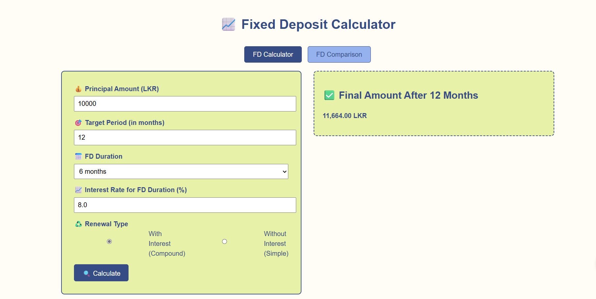
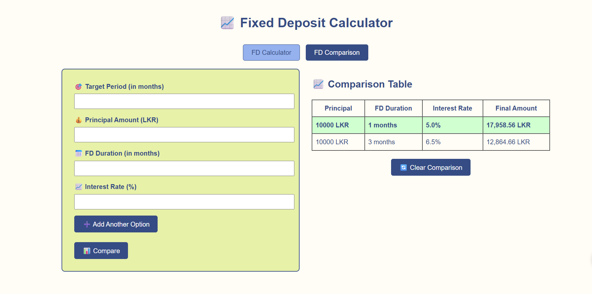

# 💰 Fixed Deposit Calculator & Comparison Tool

A simple and interactive web app built with **Java**, **Spring Boot**, **Thymeleaf**, and **H2 (in-memory DB)**. It allows users to calculate Fixed Deposit (FD) maturity values and compare multiple FD options over a target period.

## ✨ Features

- 📈 **FD Calculator**  
  Enter deposit amount, interest rate, FD duration, and choose whether it's renewable with or without interest. Get accurate maturity values.

- 🔍 **FD Comparison Tool**  
  Add multiple FD options and compare them over a selected time period to see which one gives the highest return.

- 💡 **Renewal Options**  
  Choose between:

  - Reinvest with interest (Compound Interest)
  - Reinvest without interest (Simple Interest)

- 📊 **Comparison Table Output**  
  Displays all FD options side-by-side and highlights the most profitable one.

- ♻️ **Clear Comparison**  
  Easily reset the comparison form and table to start a new evaluation.

- 🌐 **Tab-Based Interface**  
  Seamlessly switch between the calculator and the comparison tool.

---

## 🛠️ Tech Stack

| Layer      | Tech                    |
| ---------- | ----------------------- |
| Backend    | Java 24, Spring Boot 3+ |
| Frontend   | Thymeleaf (HTML + JS)   |
| Database   | H2 (In-Memory)          |
| Build Tool | Maven                   |

---

## 🚀 How to Run

1. Clone the repository:
   ```bash
   git clone https://github.com/kaveeshagim/fd-calulator-comparison-tool.git
   cd fd-calculator
   ```
2. Run the project:
   ```bash
   ./mvnw spring-boot:run
   ```
3. Open the browser:
   ```bash
   http://localhost:8080
   ```

## 📷 UI Preview

### FD Calculator



### FD Comparison



## 🧠 Learnings

This project helped me:

- ✅ Implemented financial logic with compound and simple interest
- ✅ Used Thymeleaf effectively for dynamic UI updates
- ✅ Handled conditional rendering, tab switching, and input validation
- ✅ Practiced controller-service-model structure in Spring Boot
- ✅ Gained deeper understanding of form handling, in-memory DBs, and state-driven UI

## 📬 Feedback & Contributions

Feel free to open issues or submit pull requests. Feedback is always welcome!
